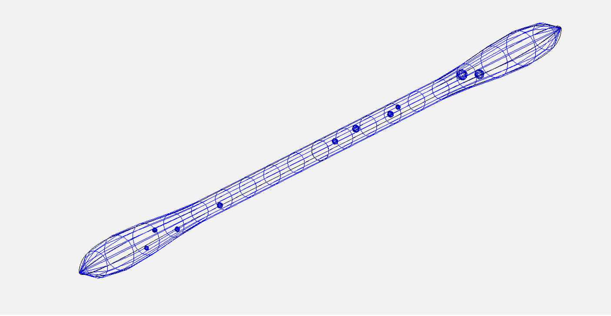

1. **Task 2 - Volume Distribution**

2. **Description**
   - This Python script places 10 volumes (ellipsoids) inside a predefined fuselage geometry created in OpenVSP.  
   - The placement ensures that volumes are fully contained within the fuselage and avoids collisions.
   - Compared to the previous version, this implementation performs a real geometric analysis of the fuselage using vsp.CompPnt01() to sample surface points, instead of relying on a simplified taper function.

3. **Inputs**
   - Predefined fuselage in OpenVSP format (`input_fuse.vsp3`)
   - 10 volumes defined by size (radius) and initial random position (inside the fuselage)

4. **Outputs**
   - 10 OpenVSP configuration files (`.vsp3`) for each generated placement
   - CSV file (`volumes_positions.csv`) containing positions and radii of all ellipsoids
   - JSON file (`volumes_data.json`) with additional metadata for each configuration (not requested but maybe useful for the future)

5. **Algorithm / Procedure**

    If input fuselage not available: **Run (`Fuselage.py`) -> output: (`input_fuse.vsp3`) -> Run (`Volumes.py`) -> output: (`configs/`)**

    If input fuselage available: **Run (`Volumes.py`) -> output: (`configs/`)**

    **U_SAMPLES** Longitudinal samples, higher value -> more precise -> slower
    **W_SAMPLES** Circumferential samples, higher value -> more precise -> slower

   1. Generate a new fuselage using (`Fuselage.py`) or load an existent fuselage VSP3 file
   2. Extract fuselage bounds: 
      - The fuselage is divided into U_SAMPLES longitudinal sections, and for each section, W_SAMPLES points are sampled around the circumference using vsp.CompPnt01().
      - These points are used to compute the center and maximum radii of each cross-section, capturing the real fuselage shape for volume placement
   3. For each of the 10 volumes : 
         - Randomly determine ellipsoid size within specified min/max limits.
         - Generate a valid position inside the fuselage considering considering the local fuselage shape and safety margins.
         - Check collisions with already placed volumes.
         - Place the volume in OpenVSP. 
   4. Repeat the above for the number of configurations specified (default 10).
   5. Save each configuration:
         - `.vsp3` file
         - CSV with volume positions
         - JSON with additional metadata

   *Libraries used :*
    - `openvsp` for geometry creation and VSP3 manipulation
    - `random` for random placement
    - `csv` and `json` for output files
    - `dataclasses` for clean volume representation
    - `os` to handle file paths
    - `math` for position calculations

6. **Examples**
   - Input: `input_fuse.vsp3` fuselage file
   - Output: 10 configurations stored in `configs/confX/`  
     Each configuration contains:
        - `fuse_confX.vsp3`
        - `volumes_positions.csv`
        - `volumes_data.json`

   **Example visualizations:**

     
   *Figure 1: Example of 10 ellipsoids placed inside the fuselage for configuration 1.*

     
   *Figure 2: Another configuration showing volume placement inside the fuselage.*

7. **Limitations / Notes**
   - Only ellipsoids are currently supported: ellipsoids are used because their 3D position and size can be easily calculated for placement and collision checks. Other shapes, such as pods or wings, do not have simple Python methods to determine their dimensions, so collision checking would be unreliable
   - Placement uses approximate collision checking (ellipsoids are considered ideal spheres)
   - Placement may require many attempts in dense configurations (computationally more expensive than the old version).
   - In highly irregular fuselages, cross-section interpolation may not be fully accurate; direct per-section checks using meshes may improve precision.

---

