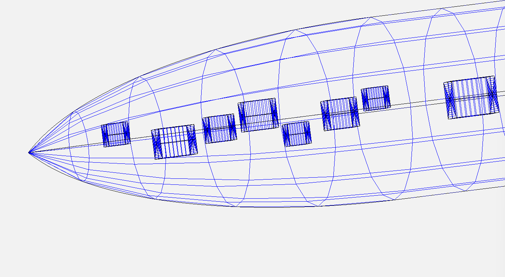

1. **Task 3 – Collision Detection & Volume Constraints**

**Important** : The only way to make boxes/custom geoms work is to manually copy the `OpenVSP-3.45.4-win64\CustomScripts` into `C:\Users\username`, this seems hardcoded by the api for some reason. Do this before running the code.

2. **Description**
The goal of this task is to place internal volumes inside a fuselage while ensuring:
   - Collision detection between volumes and fuselage walls.
   - Collision detection between volumes themselves.
   - Respect for user-defined distance constraints between specific volumes.
   - Volumes are modeled as ellipsoids (with dimensions length × width × height) and placed at defined positions.

3. **Inputs**
  -  Fuselage model (.vsp3)
  -  Loaded via `Config.INPUT_VSP`
  -  Manual volume definitions (`get_manual_volumes_example()`) Each volume includes:
      - ID
      - Position: (x, y, z) in meters
      - Dimensions: (length, width, height) in meters
      - Distance constraints: List[Tuple[target_volume_id, min_distance_m]]
   -  Configuration parameters (Config)
      - `NUM_VOLUMES`: total volumes to place
      - `SAFETY_MARGIN`: fraction of local cross-section radius for clearance
      - `LONGITUDINAL_MARGIN`: margin from fuselage ends
      - `U_SAMPLES, W_SAMPLES`: surface sampling resolution

4. **Outputs**
- Placed volumes inside fuselage. Only valid volumes that:
  - Do not intersect fuselage walls.
  -  Do not collide with each other.
  -  Respect distance constraints.
- Files generated in configs/confX/:
  - `.vsp3 file`: fuselage + placed volumes
  - `volumes_positions.csv`: ID, position, and dimensions of volumes
  - `distance_constraints.csv`: all constraints and verification status
  - `volumes_data.json`: additional metadata for the configuration (not requested but maybe useful for the future)

5. **Algorithm / Procedure**
   1. Load Fuselage
      - Reset OpenVSP model
      - Load input .vsp3
      - Find fuselage geometry by name ("fuselage" or "fuse")

   2. Analyze Real Fuselage Surface
      - Sample U_SAMPLES along fuselage length
      - Sample W_SAMPLES points around fuselage circumference per section
      - Compute:
        - Cross-section centers (center_y, center_z)
        - Effective radii (radius_y, radius_z)
        - Cross-section area

    3. Manual Volume Placement
       - Iterate through manually defined volumes
       - Validate each volume:
         - Inside fuselage: check X, Y, Z bounds with safety margin
         - Collision check with already placed volumes
         - Respect distance constraints relative to other manual volume
       - Place only valid volumes in OpenVSP as boxes
       - Update OpenVSP after each placement

    4. Collision and Constraint Handling
       - Fuselage walls: ensure y_extent and z_extent ≤ safe radii from cross-section
       - Volume collisions: center-to-center distance vs average radii
       - Distance constraints: verify minimum distance for defined volume pairs

    5. Save Configuration
       - Auto-number configurations (conf1, conf2, …)
       - Save:
         - `.vsp3 file`
         - `volumes_positions.csv`
         - `distance_constraints.csv`
         - `volumes_data.json` with:
           - Configuration metadata
           - Real cross-section data
           - Volume dimensions & distance constraints

   *Libraries used:*

   - `openvsp` (as vsp): for loading fuselage models, adding and transforming geometries, sampling points on surfaces, and saving .vsp3 files.
   - `csv`: for writing volume positions and distance constraint verification tables.
   - `json`: for exporting enhanced configuration data including sampled surface points.
   - `os`: for file and directory handling, including creating configuration folders.
   - `math`: for distance calculations and basic geometric operations.
   - `dataclasses`: to define EllipsoidVolume, CrossSection, and FuselageBounds with automatic attribute management.
   - `typing`: to define type hints like List, Tuple, and Optional for clarity and type safety.

6. **Examples**
   - Input: `input_fuse.vsp3` fuselage file
   - Select: NUM_VOLUMES, SAFETY_MARGIN (lower = risky), LONGITUDINAL_MARGIN, U_SAMPLES (higher = more precise), W_SAMPLES(higher = more precise) 
   - Modify in `def get_manual_volumes_example()`
    BoxVolume(id=1, x=0.50, y=0.00, z=0.00, length=0.40, width=0.40, height=0.40,
   distance_constraints=[(2, 0.6), (3, 0.8), (4, 0.6)]), 
      - id = id of the volume
      - x,y,z = coordinates of the center box
      - length,width,heigth = dimensions of the box
      - (target_id, min_distance) -> (2, 0.6) -> this volume must be at least 0.6 m away from the volume with id=2, can be set with multiple ids

   - Output: number of boxes that could possibly be placed and configuration .vsp3 with placement, stored in `configs/confX/`  
     Each configuration contains:
        - `fuse_confX.vsp3`
        - `volumes_positions.csv`
        - `volumes_data.json`
        - `distance_constraints.csv`

   **Example visualizations:**

     
   *Figure 1: Example of 10 boxes placed inside the fuselage for configuration 1.*

7. **Limitations / Notes**
   - In highly irregular fuselages, cross-section interpolation may not be fully accurate; direct per-section checks using meshes may improve precision.

---

