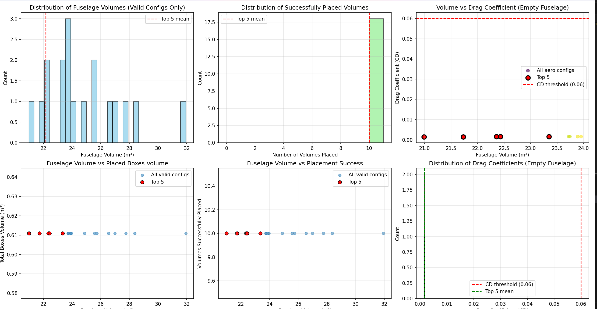
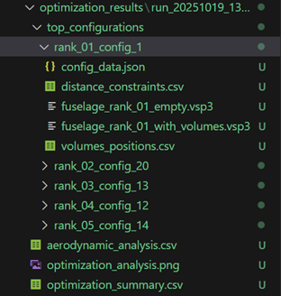

1. **Task 5 – Aerodynamic Analysis**

**Important 1** : The only way to make boxes/custom geoms work is to manually copy the `OpenVSP-3.45.4-win64\CustomScripts` into `C:\Users\username`, this seems hardcoded by the api for some reason. Do this before running the code.
**Important 2** : Generating a large number of configurations will take much time, the time remaining will be shown in console output 
**Important 3** : The three `Unnamed.csv/txt` are OpenVsp dump files, they need to be ignored
**Important 4** : use meters (the script automatically converts in feet)

2. **Description**
The goal of this script is to find an optimal fuselage design by generating and testing multiple configurations. The process ensures:
    - It generates a large number of fuselage configurations by perturbing base dimensions (length, width, height).
    - It computes the total volume for each and attempts to place 10 internal volumes, validating against containment, collision, and distance constraints.
    - It selects the top N configurations (e.g., top 100) with the smallest fuselage volume that successfully contain all internal volumes.
    - It then performs a parasite drag analysis (calculating $C_D$) on these selected configurations.
    - The final output is a filtered list of the best designs (e.g., top 5) that combine both compact volume and aerodynamic efficiency ($C_D$)

3. **Inputs**
  - Base fuselage parameters (length, width, height) defined in the OptConfig class.
  - Perturbation parameters (e.g., `LENGTH_PERTURBATION`) to define the design space.
  - A predefined list of 10 BoxVolume objects with their dimensions and specific distance constraints (defined in `get_manual_volumes()`).
  - Analysis parameters (e.g., `CD_THRESHOLD`, `ANALYSIS_SREF`, `ANALYSIS_VINF`).

4. **Outputs (go to examples for clearer understanding)** 
    - Console : debug for every phase of the script with remaining time, in the end console output of top 5 configurations, if there are errors they will show here

    - A main output directory with a timestamp (e.g., optimization_results/run_YYYYMMDD_HHMMSS/).
    - A subdirectory (top_configurations/) containing the top N (e.g., 5) final designs.
    - For each top design, a folder (e.g., rank_01_config_XX/) containing:
        - fuselage_rank_01_with_volumes.vsp3: The final fuselage with internal volumes.
        - fuselage_rank_01_empty.vsp3: The empty fuselage (in feet) used for aero analysis.
        - config_data.json: JSON file with all configuration parameters, volumes, and results.
        - volumes_positions.csv: CSV of placed volume coordinates.
        - distance_constraints.csv: CSV verifying all distance constraints were met.
    - optimization_summary.csv: A top-level CSV ranking the final best configurations.
    - aerodynamic_analysis.csv: A CSV with aero results for all N (e.g., 100) analyzed designs.
    - optimization_analysis.png: A plot grid showing volume distributions, $C_D$ histograms, and scatter plots.

5. **Algorithm / Procedure**

   1. Generate Candidate Geometries:
      - Generate `NUM_CONFIGURATIONS` (e.g., 20) sets of random perturbation factors.
      - For each set, create the perturbed fuselage geometry in OpenVSP.

   2. Volume Placement & Validation:
      - Analyze the fuselage geometry to get its precise bounds (`analyze_fuselage_geometry()`).
      - Compute the total fuselage volume (`compute_fuselage_volume_compgeom()`).
      - Attempt to place all 10 predefined BoxVolumes using random placement.
      - This process validates against:
        - Containment: All volume surface points are inside the fuselage (`is_box_inside_fuselage()`).
        - Collision: No overlap between volumes (`boxes_collide()`).
        - Constraints: Minimum surface-to-surface distances are met (`respects_distance_constraints()`).
    - Only configurations where all 10 volumes are successfully placed (`num_skipped == 0`) are kept.

    3. Volume-Based Ranking:
       - Rank all successful configurations by their fuselage volume (ascending).
       - Select the Top N (e.g., `TOP_N_VOLUME = 10`) configurations with the smallest volumes.

    4. Aerodynamic Analysis:
       - For each of the Top N volume configurations:
            - Create a new, empty version of the fuselage with dimensions converted to feet (for VSP API accuracy).
            - Run OpenVSP's parasite drag analysis (`run_parasite_drag_analysis_feet()`).
            Store the resulting parasite drag coefficient ($C_D$).

    5. Filtering & Final Selection:
       - Filter out any configurations with a $C_D$ value above `CD_THRESHOLD` (e.g., 0.06).
       - Calculate a combined_score for the remaining designs: score = 0.7 * volume_norm + 0.3 * cd_norm
       - Rank the designs by this combined score 
       - Save the final Top N (e.g., `TOP_N_FINAL = 5`) configurations and all summary files.

   *Libraries used:*

   - `openvsp` (as vsp): for geometry creation, analysis, and VSP3 manipulation
   - `numpy` for numerical operations and random generation
   - `os` and `datetime` for file/directory management
   - `json` and `csv` for output files
   - `math` for position and distance calculations
   - `dataclasses` for clean data representation (e.g., BoxVolume, FuselageConfiguration)
   - `matplotlib.pyplot` for generating summary plots
   - `tqdm` for progress bars

6. **Examples**
   - Modify Inputs (in the script): You would change these key parameters inside the OptConfig class in `Aero_analysis.py`
   - Run `Aero_analysis.py`
   - Outputs

   **Example visualizations:**

     
   *Figure 1: Graphs analysis example

      
   *Figure 2 : output directory structure*

   **Summary**
   These files provide an overview of all optimization results.
   - `aerodynamic_analysis.csv` : This CSV file lists the aerodynamic results (like $C_D$) for all the intermediate configurations that were analyzed (e.g., the "Top 10" selected by volume only).
   - `optimization_analysis.png` : This is the summary plot image. It visually displays the optimization results, such as the volume distribution, the Volume vs. Cd scatter plot, and the $C_D$ histogram
   - `optimization_summary.csv` This is the final report. It's a CSV file containing the ranked list of the best designs (e.g., the "Top 3"), sorted by their combined score (aerodynamic efficiency + low volume).
   - `top_configurations` This is the folder that contains the subfolders for all the winning designs (e.g., rank_01..., rank_02...), which are listed in the optimization_summary.csv.

    **Specific Design**
    These are the detailed output files for the design that was ranked number one.
    - `fuselage_rank_01_with_volumes.vsp3` : The OpenVSP project file for the "Rank 1" design. It contains the fuselage geometry with all 10 internal volumes correctly placed inside.
    - `volumes_positions.csv` : A CSV file listing the exact coordinates (X, Y, Z) and dimensions for each of the 10 volumes placed inside the "Rank 1" fuselage.
    - `config_data.json` :A JSON file containing all the complete metadata and results for this specific design: its geometric parameters (length, width), its final Cd value, its total volume, etc.
    - `distance_constraints.csv` : A CSV report that proves all distance constraints between volumes were met (it shows the required distance vs. the actual distance).
    - `fuselage_rank_01_empty.vsp3` :The OpenVSP project file containing only the "Rank 1" fuselage geometry (empty, without the internal volumes). This is the file that was actually used to calculate the $C_D$ value during the aerodynamic analysis.

7. **Limitations / Notes**
   - The Cd is calculated on an empty fuselage to ensure stability and avoid VSP-API issues with complex internal geometries. This means the drag contribution of internal components is ignored.
   - The combined_score function is a simple weighted sum, might need a better optimization
   - Large number of configurations might need some time, multithreading impossible 
   - Stochastic Nature (Non-Reproducibility): Due to the random nature of volume placement, running the script twice will not produce identical results. To get reproducible results, a global "seed" would need to be set for the random and numpy libraries (this is currently avoided to maximize design exploration).
   - Unit Handling (Meters vs. Feet): The script designs the geometry in meters but performs the aerodynamic analysis by converting dimensions to feet (using METERS_TO_FEET). This is a requirement for the OpenVSP analysis API. Do not change this, or the $C_D$ results will be incorrect.

---

